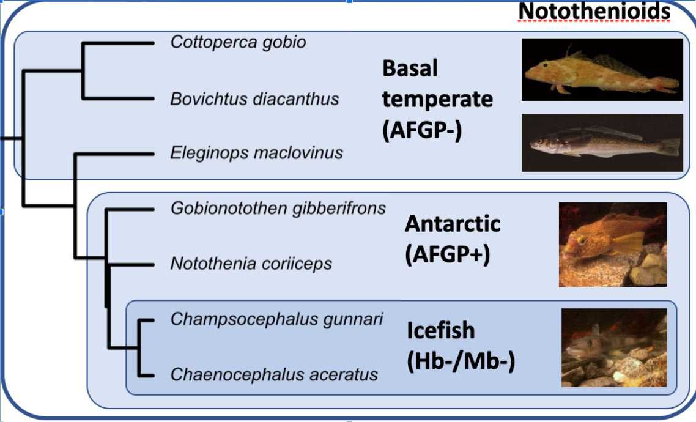

Evolution of miRNAs in Antarctic Icefish and Related Species
=================================================

## Introduction 

This repository contains scripts that have been used to analyze miRNA data.

Table of Contents 
-----------------
* [Motivation](#motivation)
* [Overview](#overview)
* [Usage](#usage)
* [Authors and history](#authors-and-history)
* [Acknowledgments](#acknowledgments)
* [References](#references)

## Motivation

Global climate change is happening fast and is strongest at the poles. These dramatic changes are threatening the existence of their highly-specialized forms of life. Antarctic fishes are especially vulnerable because they have been acclimated to consistently freezing waters for tens of millions of years. We thus want to understand how these unique animals evolved and what their capacity to changing climates can be. We focus on microRNAs (miRNAs), which are crucial regulators of gene expression implicated in countless biological processes including cell differentiation and proliferation, organ development and physiology, various pathologies and diseases, and the buffering of genetic noise especially in stressful conditions like the frigid Antarctic waters. Furthermore, miRNAs evolve in lineage- and environment-specific manners and can modulate alternative developmental and physiological pathways that may influence adaptation, diversification, and speciation. We do not yet understand, however, the roles of miRNAs in evolution and adaptation to extreme environments and extreme physiological conditions. 

To address this problem, we aim to understand how gene expression regulation by microRNAs evolved in the highly-specialized, antifreeze-bearing Antarctic notothenioid fishes compared to their temperate relatives that do not have antifreeze. The biogenesis and function of miRNAs depends on nucleotide base pairing, which is highly influenced by temperature. Without compensations, at the temperature Antarctic fish live in, miRNA biogenesis by the formation of a miRNA hairpin and of miRNA duplexes would be impaired and their function altered. We hypothesize that miRNAs in Antarctic fishes evolved sequence adaptations that compensate for greater base-pairing strength induced by the frigid Antarctic environment.

In addition, Antarctic fishes include the truly unique, white-blooded icefishes, which are the only vertebrates on earth devoid of hemoglobin. Their blood is thus translucent white and can transport only a fraction of the oxygen that the blood of their red-blooded relatives can carry, making them perfect evolutionary mutant models of human anemias. We hypothesize that novel miRNAs evolved in the icefish lineage that regulate unique physiological pathways that adapt them to this extreme and otherwise harmful condition.

## Overview

This project uses 68 small read RNA data extracted from 7 species of fish, shown in the phylogeny below, their completed genomes and a list of all known miRNA for each species [[1]] (http://www.fishmirna.org/). This data was run through the workflow outlined in the miRDeep2 subdirectory to detect novel microRNA's and a selected subset of the discovered novel microRNA and all known microRNA's was analyzed using the procedures outlined in the remaining subdirectories. 



## Usage
- Clone the repository
```bash
git clone 'https://github.com/tcollins2011/Postlethwait_miRNA'
```
- Navigate to each subdirectory and execute its readme 

## Authors and History

* Logan Lewis - Algorithm Design, Contact:
* Beagan Nguy - Algorithm Design, Contact: bnguy@ucsc.edu
* Tyler Collins - Algorithm Design, Contact:
* Thomas Desvignes - Conceptual Design Leader
* John H. Postlethwait - Project Advisor

## Acknowledgments

We’d like to thank Dr. Thomas Desvignes and Dr. John Postlethwait for their guidance on the project, as well as the wonderful BGMP staff: Jason Sydes, Pete Batzel, Dr. Leslie Coonrod, and Dr. Stacey Wagner.
Sequencing performed at the University of Oregon Genomics Characterization Core Facility (GC3F). This work benefited from access to the University of Oregon supercomputer, Talapas.
 
## References 
- [1] Beck EA, Healey HM, Small CM, Currey MC, Desvignes T, Cresko WA, Postlethwait JH. 2021. Advancing human disease research with fish evolutionary mutant models. Trends in Genetics [Internet] 0. Available from: https://www.cell.com/trends/genetics/abstract/S0168-9525(21)00191-8
- [2] Desvignes T, Batzel P, Berezikov E, Eilbeck K, Eppig JT, McAndrews MS, Singer A, Postlethwait JH. 2015. miRNA Nomenclature: A View Incorporating Genetic Origins, Biosynthetic Pathways, and Sequence Variants. Trends in Genetics 31:613–626.
- [3] Desvignes T, Batzel P, Sydes J, Eames BF, Postlethwait JH. 2019. miRNA analysis with Prost! reveals evolutionary conservation of organ-enriched expression and post-transcriptional modifications in three-spined stickleback and zebrafish. Scientific Reports 9:3913.
- [4] Desvignes T, Detrich III HW, Postlethwait JH. 2016. Genomic conservation of erythropoietic microRNAs (erythromiRs) in white-blooded Antarctic icefish. Marine Genomics 30:27–34.
- [5] Desvignes T, Sydes J, Montfort J, Bobe J, Postlethwait JH. 2021. Evolution after Whole-Genome Duplication: Teleost MicroRNAs. Molecular Biology and Evolution 38:3308–3331.
- [6] Franchini P, Xiong P, Fruciano C, Meyer A. 2016. The Role of microRNAs in the Repeated Parallel Diversification of Lineages of Midas Cichlid Fish from Nicaragua. Genome Biol Evol 8:1543–1555.
- [7] Kelley JL, Desvignes T, McGowan KL, Perez M, Rodriguez LA, Brown AP, Culumber Z, Tobler M. 2021. microRNA expression variation as a potential molecular mechanism contributing to adaptation to hydrogen sulphide. Journal of Evolutionary Biology 34:977–988.
- [8] Kim B-M, Amores A, Kang S, Ahn D-H, Kim J-H, Kim I-C, Lee JH, Lee SG, Lee H, Lee J, et al. 2019. Antarctic blackfin icefish genome reveals adaptations to extreme environments. Nature Ecology & Evolution 3:469.
